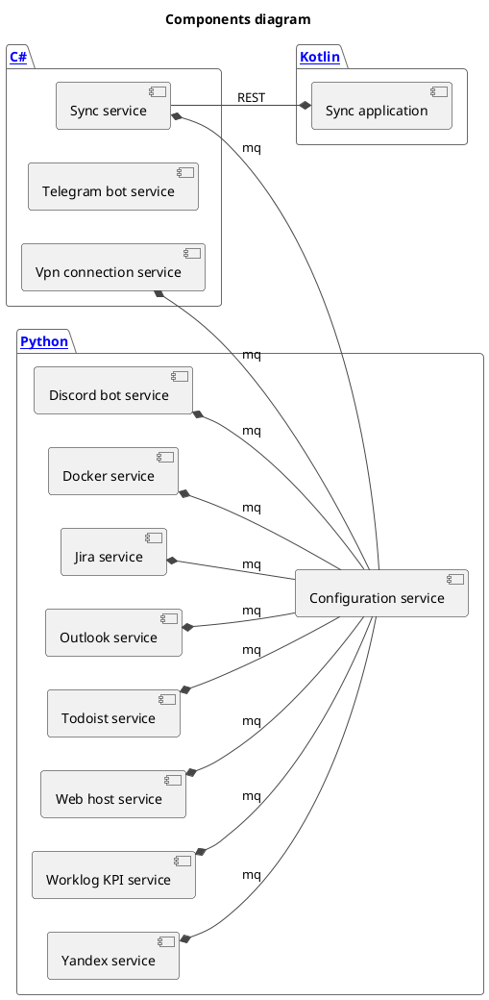

Arch

```plantuml
@startuml
!theme vibrant

title Components diagram

left to right direction

package kotlin as "[[https://github.com/dimterex/FileSyncAndroidClient{Kotlin} Kotlin]]"  {
    component "Sync application" as sync_f
}

package csproj as "[[https://github.com/dimterex/FileSyncService{C#} C#]]" {
    component "Sync service" as sync_b
    component "Telegram bot service" as telegram
    component "Vpn connection service" as vpn
}

package python as "[[https://github.com/dimterex/outlook2tracker{Python} Python]]" {
    component "Configuration service" as config
    component "Discord bot service" as discord
    component "Docker service" as docker
    component "Jira service" as jira
    component "Outlook service" as outlook
    component "Todoist service" as todoist
    component "Web host service" as web_host
    component "Worklog KPI service" as worklog
    component "Yandex service" as yandex
}

sync_b --* sync_f: REST

sync_b *-- config: mq
vpn *-- config: mq
discord *-- config: mq
docker *-- config: mq
jira *-- config: mq
outlook *-- config: mq
todoist *-- config: mq
web_host *-- config: mq
worklog *-- config: mq
yandex *-- config: mq

@enduml
```